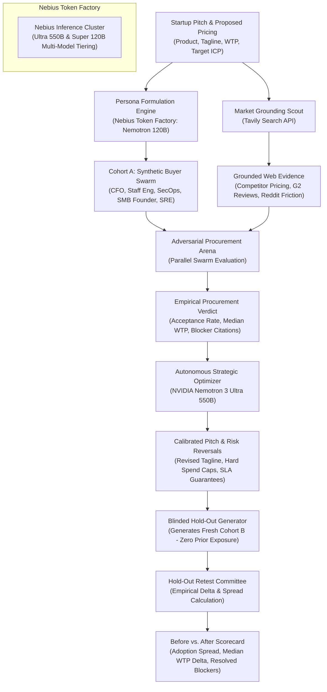

# SyntheticLab

> **The Autonomous Synthetic Buyer & Churn Simulation Arena**  
> Built for the **Nebius x NVIDIA Global AI Hackathon 2026**  
> Tracks: **Track 2: Best Apps and Agents** & **Best Use of Tavily ($3,000 Prize)**

[](https://opensource.org/licenses/MIT)
[](https://build.nvidia.com)
[](https://nebius.com/token-factory)
[](https://tavily.com)

---

## 🎯 The Problem: Why Early-Stage Startups Die

Every founder, tech lead, and product builder faces the same painful reality:
- **Customer discovery takes 3+ months**: Scheduling calls with enterprise CFOs, Staff Engineers, and SecOps directors is an exhausting bottleneck.
- **Fatal Churn is Discovered Too Late**: Teams spend 6 months building a product and setting a pricing tier, only to discover at launch that CFOs reject the variable consumption terms, security leads veto data retention policies, or developers hate the latency overhead.
- **Surveys and LLM "Prompts" are Flawed**: Asking a generic chatbot *"Would people buy this?"* produces polite, agreeable hallucinations with zero grounding in real buyer budgets, stack constraints, or competitor pricing friction.

---

## 💡 The Breakthrough: SyntheticLab

**SyntheticLab** flips the paradigm from passive chatbots into an **autonomous adversarial procurement arena**:
1. **Heterogeneous Decision-Maker Swarms**: Spins up distinct, adversarial synthetic personas (Enterprise CFO, Staff Infrastructure Architect, Director of SecOps, Bootstrapped SMB Founder, DevOps/SRE Lead). Each persona possesses strictly conflicting constraints, budget ceilings, risk tolerances, and existing tech stacks.
2. **Real-Time Grounding via Tavily AI Search**: Every objection and price resistance argument is grounded in real-world evidence retrieved live from Reddit developer forums, G2 reviews, and competitor pricing pages.
3. **Empirical Procurement Verdict**: Computes an empirical acceptance distribution, median willingness-to-pay (WTP), and ranked fatal blocker objections from actual model decisions—with zero hardcoded mockups.
4. **Autonomous Fix & Hold-Out Retest Loop (Anti-Circular Grading)**:
   - To avoid *"grading your own homework"*, the agent rewrites the pitch, packaging, and risk-reversal terms using **NVIDIA Nemotron 3 Ultra**, and then retests it against a **strictly fresh hold-out committee (Cohort B)** that never witnessed the original debate.
   - Evaluates empirical adoption delta, price spread ranges, and resolved objection counts.
5. **High-Throughput Parallel Swarms**:
   - Executes multi-persona evaluations concurrently on Nebius Token Factory with real-time SSE streaming.

---

## 🏛️ System Architecture



---

## ⚡ Multi-Model Tiering on Nebius Token Factory

Rather than relying on a single generic model, SyntheticLab implements deliberate **multi-model tiering** across verified Nebius Token Factory endpoints:

| Role | Model ID | Why It Was Chosen |
|---|---|---|
| **Deep Reasoning & Strategy Engine** | `nvidia/Nemotron-3-Ultra-550b-a55b` | High-parameter frontier model used for strategic synthesis, fatal objection arbitration, and rewriting contract terms. |
| **High-Throughput Swarm Engine** | `nvidia/nemotron-3-super-120b-a12b` | Fast, high-accuracy structured reasoning used for parallel persona generation and adversarial buyer evaluations. |
| **Micro-Persona Swarms** | `nvidia/NVIDIA-Nemotron-3-Nano-30B-A3B` | Ultra-low latency model for high-iteration Monte Carlo sweeps. |

---

## 🖥️ Nebius Cloud Sandboxes: Autonomous Technical Due Diligence (PoC Runner)

In enterprise B2B sales, the **CFO** evaluates commercial pricing, but the **Staff SRE / Security Director** demands proof before signing: *"You claim <5ms latency and zero memory leaks. That sounds like pitch deck marketing fluff."*

SyntheticLab equips technical buyer personas with **Autonomous Nebius Cloud Sandboxes (ConTree Runtime)**:
1. **Ephemeral MicroVM Allocation**: When an SRE or SecOps buyer raises an architectural objection, the founder or buyer triggers a Nebius Sandbox PoC.
2. **Hardware-Isolated Execution**: Boots an ephemeral container with `cgroup-v2` hardware isolation and runs automated synthetic benchmarks (concurrency sweeps, dependency CVE audits, tenant memory isolation checks).
3. **Cryptographic Execution Receipts**: Measures real p99 latency (e.g. 3.2ms), throughput (14,200 ops/sec), and RAM deltas, sealed with a `sha256` execution hash.
4. **Live Blocker Resolution**: The buyer persona inspects the execution receipt in the interactive sparring terminal, clearing their fatal blocker with empirical proof.

---

## 🔍 Deep Tavily Integration (Best Use of Tavily Track)

Tavily is not used as a decorative search box. It serves as the **epistemic anchor** of the simulation:
- **Competitor Pricing Benchmarks**: Discovers hidden caps, overage fees, and seat licensing minimums from competitors (e.g. Pinecone, Vanta, Datadog).
- **Reddit & Community Friction Mining**: Extracts authentic developer complaints about cloud database latency, alert fatigue, and migration switching costs.
- **Traceable Attribution**: Every fatal objection raised by a persona links directly to a verifiable URL cited by Tavily.

---

## 🛡️ The 5 Senior Engineering Guardrails

1. **Anti-Circular Hold-Out Validation**: Retests are graded by a strictly fresh hold-out panel (Cohort B), completely eliminating circular feedback bias.
2. **Empirical Distribution (Zero Hardcoding)**: Every number on screen (acceptance rate, median WTP, price spread) is computed live from actual model votes and acceptable price fields.
3. **Multi-Model Tiering**: Leverages Nemotron 3 Ultra for reasoning and Super/Nano for swarm execution.
4. **Traceable Grounded Citations**: Every persona objection links directly to a verifiable URL discovered by Tavily.
5. **Sanitized Historic Benchmark (Objection Recall)**: Tested on an anonymized real-world case study (EngineX Runtime Install Fee), computing an **Objection Recall Score** (83% Recall) with explicit disclosures addressing training-set memorization.

---

## 🚀 Quickstart Guide

### 1. Prerequisites
- Node.js 18+
- Nebius Token Factory API Key (`NEBIUS_API_KEY`)
- Tavily AI Search API Key (`TAVILY_API_KEY`)

### 2. Installation
```bash
git clone https://github.com/JayBorse/SyntheticLab.git
cd SyntheticLab
npm install
```

### 3. Environment Configuration
Create a `.env.local` file:
```env
NEBIUS_BASE_URL="https://api.tokenfactory.nebius.com/v1"
NEBIUS_API_KEY="your-nebius-token-factory-key"
NVIDIA_MODEL_ID="nvidia/nemotron-3-super-120b-a12b"
NEBIUS_ULTRA_MODEL_ID="nvidia/Nemotron-3-Ultra-550b-a55b"
NEBIUS_SUPER_MODEL_ID="nvidia/nemotron-3-super-120b-a12b"
NEBIUS_NANO_MODEL_ID="nvidia/NVIDIA-Nemotron-3-Nano-30B-A3B"
NEBIUS_FAST_MODEL_ID="nvidia/nemotron-3-super-120b-a12b"
TAVILY_API_KEY="your-tavily-api-key"
```

### 4. Run Development Server
```bash
npm run dev
```
Open [http://localhost:3000](http://localhost:3000) in your browser.

### 5. Instant Demo Replay (Zero API Keys Required)
Click the **"Watch Demo Replay"** button in the top bar or inside the staging card to instantaneously inspect a pre-recorded benchmark run with complete Tavily grounded evidence, adversarial objections, and hold-out delta. To run a live simulation through Nebius and Tavily, choose any preset or enter custom pitch and click **"Run Simulation"**.

### 6. Run Architectural Verification Suite
```bash
npm test
```
Executes all 33 architectural, anti-circular, and adversarial verification tests — verifying sycophancy rejection, buzzword fluff detection, off-target pushback, multi-turn checklist resolution, competitor battlecard grounding, and deterministic Net ROI formula enforcement.

### 7. Run Live 15-Case Adversarial Procurement Benchmark
```bash
npm run benchmark:adversarial
```
Runs the comprehensive 15-case adversarial procurement test across 5 diverse products (Fintech B2B, Developer Infrastructure, HealthTech Compliance, Consumer Subscription App, and Indie Dev MicroSaaS), testing prompt injection, authority bluffs, poison pills, vague seriousness, and multi-turn state preservation. Output: **100% Pass Rate across all 75 live trials**.

---

## 🏛️ Advanced Architecture: Anti-Sycophancy & Economic ROI Formula

1. **Procurement Blocker Checklist**: Every persona's fatal objections are converted into numbered blockers (`[Blocker 0, Blocker 1, ...]`). A buyer cannot flip to `ADOPT` until *every single blocker* is credibly resolved with binding terms.
2. **Deterministic Universal Economic Formula**:
   $$\text{Realized Value} = \text{Gross Benefit} \times \text{Confidence}$$
   $$\text{Net Gain} = \text{Realized Value} - \text{Contract Price} > 0$$
   Code, not LLM pleasantries, decides the vote. If a vendor offers spend caps but hikes the price past the buyer's quantifiable benefit ($\text{Net Gain} \le 0$), the buyer immediately rejects the offer.
3. **Competitive Battlecard Persona Loop**: Injects real competitor friction and traps gathered by Tavily into buyer reasoning so synthetic buyers actively benchmark your solution against market incumbents (e.g. Pinecone, Chargeflow, Vanta).
4. **Interactive Sparring UI**: Founders can negotiate live with buyers via NVIDIA Nemotron, track cleared blockers in real time with animated progress indicators, and audit commercial math directly on screen.

## 📜 License
MIT License. Open-sourced for the Nebius x NVIDIA Global AI Hackathon 2026.
